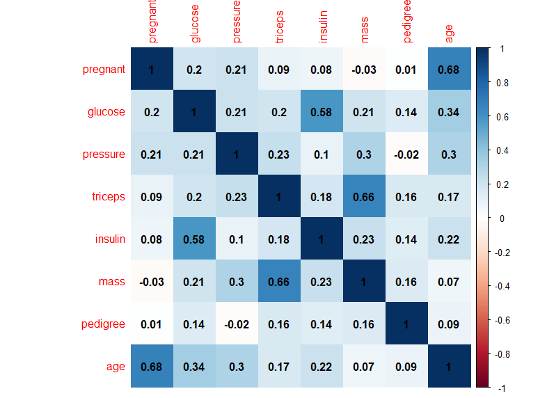
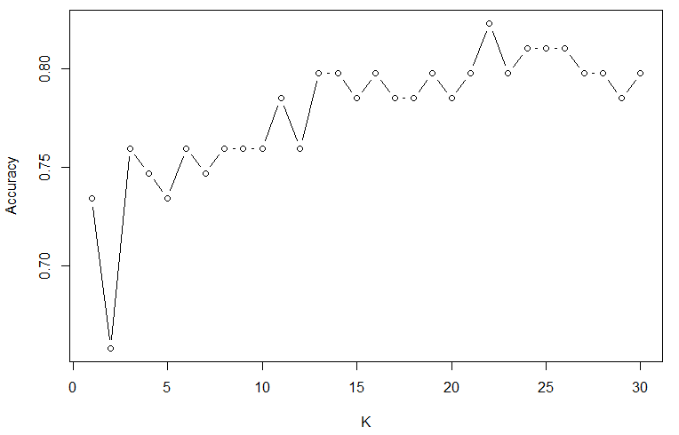

# 1 Introduction

This report uses the PimaIndiansDiabetes2 dataset from the “mlbench” package in R for the purpose of building a model to predict diabetes with certain information. The hypothesis is that logistic regression is the most accurate model as the outcome variable(diabetes) is a binary value. Diabetes is a life-threatening disease that affects many people and being able to predict diabetes allow us to pre-empt diabetes and recommend possible prevention measure.

# 2 Data description and data cleansing 
PimaIndians diabetes dataset was used. This dataset consists of 768 records with 500 records for non-diabetic class and 268 diabetic class. We clean the dataset by removing the incomplete cases in the PimaIndiansDiabetes2 dataset which results in 392 records; 262 records for non-diabetic class and 130 records for diabetic class. Next, we plot histograms of all the variables to observe their distribution. 

Finally, we manipulate it by changing “diabetes” variable values from pos/neg to binary values. We then spilt the dataset, use 80% for training the model and the remaining 20% for testing the model.

# 3 Key ML techniques used 
Since diabetes is a categorical variable, we will use classification machine learning techniques to find the best model to predict diabetes.

## 3.1 Support Vector Machine (SVM) 
SVM is a technique of supervised machine learning used for classification and regression. We choose SVM because the hyperplane is affected only by the support vectors, so outliers have lesser impact on classification accuracy.

## 3.2 Logistic regression 
Logistic regression uses a logistic function to model a binary dependent variable and converts log-odds to probability. We choose logistic regression because our dependent variable(diabetes) is binary and it is simple to implement and efficient.

## 3.3 k-Nearest Neighbour (kNN) 
The k-nearest neighbour is an instance-based learning where the function is only approximated locally, and all computation is deferred until classification. We choose kNN because it is a non-parametric approach so there are no distribution assumptions on data.

## 3.4 Classification performance measurement
We will be using confusion matrixes to describe classification performance.  We have the following terms:
1)	True Positive (TP) – number of records with diabetic class predicted as diabetic class
2)	False Positive (FP) – number of records with non-diabetic class predicted as diabetic class.
3)	True Negative (TN) – number of records with non-diabetic class predicted as non-diabetic class. 
4)	False Negative (FN) – number of records with diabetic class predicted as non-diabetic class. 
We will use classification accuracy as the quality measure. Classification accuracy is defined as the ratio of occurrences that are appropriately categorized by the classification technique. 
Classification Accuracy=(TP+TN) / (TP+TN+FP+FN)  

# 4 Results and discussion
The three machine learning techniques mentioned above were applied for the classification of 79 diabetes records; 56 records of non-diabetic class and 23 records of diabetic class. Confusion matrix of prediction results are tabulated in Table 1 to Table 4 for SVM, logistic regression and kNN.
From Fig 1, we can observe that kNN has the best classification accuracy of 81.0%. However, when we look at Table 1 to Table 4, we observe that aside from SVM with radial kernel, the other 3 classification methods have similar confusion matrixes. This could be due to the low sample size of 79 for testing the model and a larger sample size may be needed for better classification accuracy.

**Fig 1**
| Method  | Classification Accuracy |
| ------------- | ------------- |
| SVM with linear kernel  | 79.7%  |
| SVM with radial kernel  | 77.2%  |
| Logistic regression  | 78.5%  |
| kNN   | 81.0%  |

# 5 Evaluation and possible improvements

From the correlation matrix below below, we observe that there are 3 pairs of variables that have a high correlation coefficient: age and pregnant, insulin and glucose, mass and triceps. This means that these variables are collinear to each other in the pair. This suggests that we should have only included 1 variable out of each pair as predictor variables as we need our predictor variables to be independent in order to minimise errors in prediction.

The dataset used had 262 records for non-diabetic class and 130 records for diabetic class which is imbalanced. This means the models will be biased towards predicting non-diabetic class which can be observed in the confusion matrixes of each model. 

# 6 Conclusion

From the analysis, the kNN model is the most accurate when it comes to predicting diabetes, but further improvements are needed to optimise the model and improve its classification accuracy as mentioned in the previous section.

# 7 Appendix

Accuracy plot for k value for kNN
